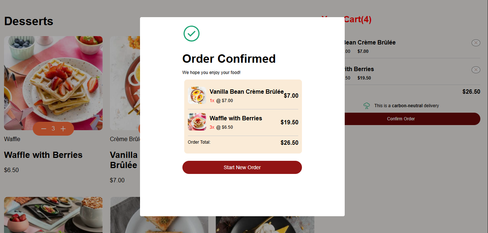

## Table of contents

  - [The challenge](#the-challenge)
  - [Screenshot](#screenshot)
  - [Links](#links)
- [My process](#my-process)
  - [Built with](#built-with)
  - [What I learned](#what-i-learned)
  - [Continued development](#continued-development)
  - [Useful resources](#useful-resources)
- [Author](#author)
- [Acknowledgments](#acknowledgments)

### The challenge

Users should be able to:

- Add items to the cart and remove them
- Increase/decrease the number of items in the cart
- See an order confirmation modal when they click "Confirm Order"
- Reset their selections when they click "Start New Order"
- View the optimal layout for the interface depending on their device's screen size
- See hover and focus states for all interactive elements on the page

### Screenshot

.png>)

### Links

- Solution URL: [Product-list-with-cart](https://www.frontendmentor.io/challenges/)
- Live Site URL: [Product-list-with-cart](https://shanmukh-19.github.io/Product-list-with-cart/)

## My process

I created three components — Product List, Cart, and Order. I designed each component individually and then integrated them to work together.

### Built with

- Angular
- Used Angular Material

### What I learned

This challenge helped me gain experience with service injection, MatDialog from Angular Material, and data migration, along with other key Angular concepts 

### Continued development

I need to focus more on writing reusable code and improving my responsive design skills.

## Author

- Frontend Mentor - [@Shanmukh-19](https://www.frontendmentor.io/profile/Shanmukh-19)

